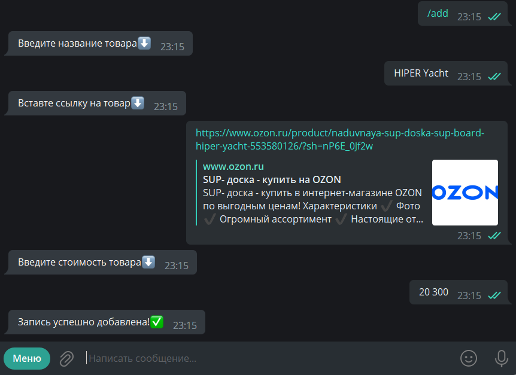
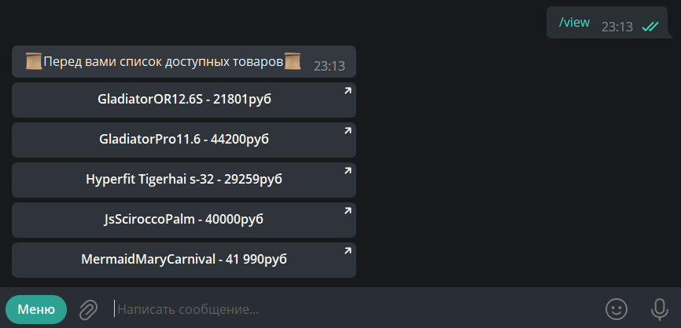

# Board shop
Этот бот представляет из себя "слив" **сап бордов**,
 в нем отобраны лучшие недорогие сапы со всего интернета!

    sup board(сап борд) - это такие надувные доски с веслом

## Инструкция к использованию:
При старте бот проинформирует вас о меню, чтоб вы не потерялись

В меню находятся список команд, которые бот может выполнить

    
+ Команда **add** позволяет занести новый продукт в базу данных

При добавлении новой позиции необходимо указать ее название,
прикрепить ссылку на источник и указать стоимость

+ Команда **delete** обратна команде **add**,
она удаляет продукт из базы данных

Для удаления, необходимо указать только название продукта,
который хотите удалить

+ Команда **view** выводит список всех товаров на экран в виде кнопки,
нажав на которую можно перейти на сайт, на котором данный товар продается 

+ В качестве базы данных (или правильнее будет сказать СУБД) была 
была использована **sqlite3**